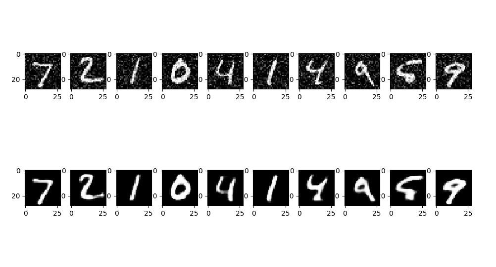

# Denoising Autoencoder for MNIST dataset

This project is a convolution based autoencoder written in Python using Tensorflow that takes noisy images from MNIST dataset and performs noise removal to return denoised images. It uses high levelTensorflow API for designing, training, and testing of the network.

## Getting Started

Clone the repository or simply download it.

### Prerequisites
The project requires you to have python3, tensorflow, numpy, matplotlib(for visualizing results) and an internet connection(to download the dataset for the first time). 

### Installing
Download Python from the Python website

pip install tensorflow

or, if you have a gpu

pip install tensorflow-gpu

pip install numpy

pip install matplotlib

## Deployment
Open terminal in the project folder. 

To train the model, use

python autoencoder_train.py

If you want to use the pretrained model, uncomment the 'load previously trained model' section and comment the 'training params', 'input layer', 'encoding', 'decoding', 'output layer', 'model' and 'train' sections.

For prediction using the trained model, use

python autoencoder_predict.py

## Results

Achieved a test accuracy of 81%.

Prediction results on test images from MNIST. Row 1 has noisy images. Row 2 are the denoised images given by the autoencoder.

## Built With

* Python     [https://www.python.org]
* Tensorflow [https://www.tensorflow.org]
* NumPy      [http://www.numpy.org/]
* Matplotlib [https://matplotlib.org/]
